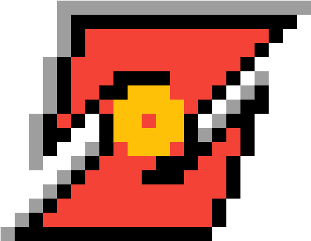
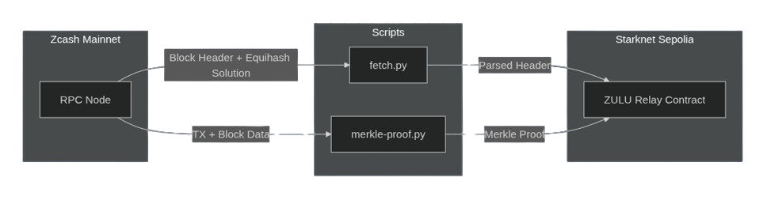
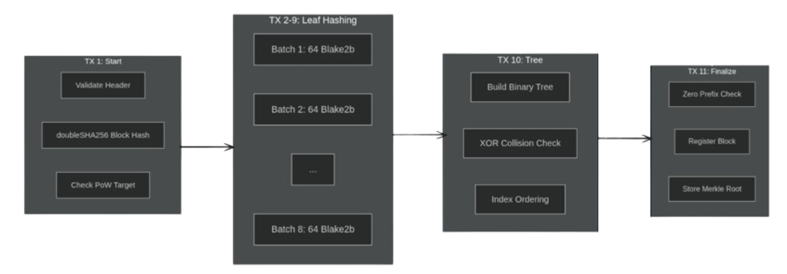

<p align="center">
  
</p>

<h1 align="center">Z.U.L.U.</h1>

<h3 align="center"><i>Zcash Universal Linking Utility</i></h3>

<p align="center">
  <i>Relay Zcash blocks to Starknet, verify transactions trustlessly, repeat</i>
</p>

<p align="center">
  <a href="https://github.com/scr1ptjunk13/zcash-relay-on-starknet">
    
  </a>
  <a href="https://www.zcashcommunity.com/">
    
  </a>
  <a href="https://starknet.io/">
    
  </a>
</p>

---

ZULU is a **trustless Zcash block relay** on Starknet. It enables on-chain verification of Zcash block headers including full **Equihash proof-of-work validation** — the first of its kind. With ZULU, you can prove that a Zcash transaction occurred without trusting any third party.

## Disclaimer

This codebase is an experimental PoC built for the **Zypherpunk Starknet Track 2025**. It has not undergone a professional audit. Use at your own risk.

---

## Why ZULU?

ZULU brings Zcash to Starknet trustlessly. Unlike centralized bridges that rely on multisigs or oracles, ZULU verifies every block header cryptographically on-chain:

- **Full Equihash Verification**: The complete (n=200, k=9) Equihash PoW algorithm runs on Starknet
- **Optimized Blake2b**: Custom implementation with 60% gas reduction vs naive approach
- **Transaction Inclusion Proofs**: Prove any Zcash TX exists using Merkle proofs
- **No Trusted Parties**: Pure cryptographic verification, no oracles or committees

### Use Cases

- **Cross-chain Bridges**: Verify Zcash deposits on Starknet for trustless bridging
- **Payment Verification**: Prove Zcash payments occurred without running a full node
- **DeFi Integration**: Enable Zcash collateral or liquidity on Starknet protocols

---

## Architecture

### System Overview



### Multi-Transaction Block Verification

Equihash verification is split across **11 transactions** to fit within Starknet gas limits:



---

## Key Features

### 1. On-Chain Equihash Verification

The first fully on-chain Equihash verifier on Starknet. Verification is split across 11 transactions to fit within gas limits:

| Transaction | Purpose | Gas (approx) |
|-------------|---------|--------------|
| TX 1 | Start verification, validate header | ~0.5 STRK |
| TX 2-9 | Blake2b leaf hash batches (64 leaves each) | ~1.5 STRK each |
| TX 10 | Build Merkle tree, verify collisions | ~1 STRK |
| TX 11 | Finalize and register block | ~0.5 STRK |
| **Total** | **Full block verification** | **~15 STRK** |

### 2. Optimized Blake2b

Custom Cairo implementation with significant optimizations:

- **Unrolled rounds**: All 12 compression rounds fully unrolled
- **Hardcoded sigma permutations**: No runtime lookups
- **Precomputed Equihash state**: Cached initialization for Zcash parameters
- **First block caching**: Header compression cached across 512 hashes

**Result**: ~60% gas reduction compared to naive implementation (from ~39 STRK to ~15 STRK per block).

### 3. Transaction Inclusion Proofs

Verify any Zcash transaction occurred on-chain:

```
User provides:
  • TX ID
  • Block Hash  
  • Merkle Branch (sibling hashes)
  • Merkle Index

Contract verifies:
  • Block is registered ✓
  • Merkle proof is valid ✓
  • TX is included in block ✓
```

### 4. Chain Management

- **Canonical chain tracking**: Height-indexed block storage
- **Cumulative PoW calculation**: For chain comparison and fork resolution
- **Fork detection**: `find_fork_point` for chain reorganizations
- **Finality depth**: Configurable confirmation requirements

---

## Contract Interface

```cairo
#[starknet::interface]
trait IZcashRelay<TContractState> {
    // Block Verification (11 transactions)
    fn start_block_verification(ref self: TContractState, header: ZcashBlockHeader) -> felt252;
    fn verify_leaves_batch(ref self: TContractState, verification_id: felt252, batch_id: u32, header: ZcashBlockHeader);
    fn verify_tree_all_levels(ref self: TContractState, verification_id: felt252, header: ZcashBlockHeader);
    fn finalize_block_verification(ref self: TContractState, verification_id: felt252, header: ZcashBlockHeader) -> Result<Digest, RelayError>;

    // Read Functions
    fn get_block(self: @TContractState, height: u64) -> Digest;
    fn get_chain_height(self: @TContractState) -> u64;
    fn get_status(self: @TContractState, block_hash: Digest) -> BlockStatus;
    fn is_block_finalized(self: @TContractState, block_hash: Digest) -> bool;

    // Transaction Verification
    fn verify_transaction_in_block(
        self: @TContractState,
        block_hash: Digest,
        tx_id: Digest,
        merkle_branch: Span<Digest>,
        merkle_index: u32
    ) -> Result<bool, RelayError>;

    // Chain Analysis
    fn get_cumulative_pow(self: @TContractState, block_hash: Digest, max_depth: u32) -> u256;
    fn find_fork_point(self: @TContractState, block_hash_a: Digest, block_hash_b: Digest, max_depth: u32) -> Digest;
}
```

---

## Project Structure

```
zcash-relay-on-starknet/
├── src/                          # Cairo contracts
│   ├── relay.cairo               # Main relay contract
│   ├── interfaces.cairo          # Contract interface
│   ├── errors.cairo              # Error definitions
│   ├── events.cairo              # Event definitions
│   ├── utils/
│   │   ├── blake2b_ultra.cairo   # Optimized Blake2b implementation
│   │   ├── hash.cairo            # Digest type and helpers
│   │   ├── double_sha256.cairo   # Double SHA-256 for block hashing
│   │   └── ...
│   └── zcash/
│       ├── block.cairo           # Block header structure
│       ├── equihash.cairo        # Equihash verification
│       ├── verification.cairo    # Incremental verification logic
│       └── ...
├── scripts/
│   ├── fetch.py                  # Fetch Zcash block headers
│   ├── merkle-proof.py           # Generate Merkle proofs for TX verification
│   └── relay-block.sh            # Automation script for block relay
├── frontend/                     # React frontend
│   └── src/
│       ├── pages/
│       │   ├── Home.tsx          # Dashboard
│       │   ├── Blocks.tsx        # Block explorer
│       │   ├── Bridge.tsx        # TX verification demo
│       │   └── Verify.tsx        # Block verification UI
│       └── ...
├── backend/                      # Express backend
│   └── index.js                  # API server + WebSocket
└── tests/                        # Cairo tests
```

---

## Quick Start

### Prerequisites

- [Scarb](https://docs.swmansion.com/scarb/) (Cairo package manager)
- [Starknet Foundry](https://foundry-rs.github.io/starknet-foundry/)
- Node.js 18+
- Python 3.10+

### Build Contracts

```bash
scarb build
```

### Run Tests

```bash
snforge test
```

### Deploy Contract

```bash
# Set up environment
cp .env.example .env
# Edit .env with your Starknet account details

# Deploy
sncast deploy --class-hash <CLASS_HASH>
```

### Run Frontend

```bash
cd frontend
npm install
npm run dev
```

### Run Backend

```bash
cd backend
npm install
npm start
```

---

## Deployed Contracts

| Network | Contract Address |
|---------|------------------|
| Starknet Sepolia | `0x0546f738f87885a936cb8df8085b4b3fdc9bf1be6449cf5f9967c4a5892a12dc` |

---

## Gas Benchmarks

Measured on Starknet Sepolia testnet:

| Operation | Gas Cost | Notes |
|-----------|----------|-------|
| Full block verification | ~15 STRK | 11 transactions total |
| Single leaf batch (64 hashes) | ~1.5 STRK | Blake2b optimized |
| TX inclusion proof | ~0.01 STRK | View function (free) |

### Optimization Impact

| Implementation | Cost per Block | Improvement |
|----------------|----------------|-------------|
| Naive Blake2b | ~39 STRK | Baseline |
| Optimized (ZULU) | ~15 STRK | **60% reduction** |

---

## Demo

### Block Verification Flow

1. **Fetch block** from Zcash mainnet via RPC
2. **Start verification** - validates header structure, computes block hash
3. **Submit leaf batches** - 8 transactions computing 512 Blake2b hashes
4. **Build tree** - constructs Merkle tree from leaves, verifies collisions
5. **Finalize** - registers block in canonical chain

### Transaction Proof Flow

1. **Get Merkle proof** using `merkle-proof.py` script
2. **Submit to Bridge page** with TX ID and block hash
3. **Contract verifies** proof against stored Merkle root
4. **Result**: Trustless confirmation that TX exists on Zcash

---

## Acknowledgments

- [Raito](https://github.com/keep-starknet-strange/raito) - Bitcoin ZK client inspiration
- [UTU Relay](https://github.com/lfglabs-dev/utu_relay) - Bitcoin relay reference
- [Zoro](https://github.com/starkware-bitcoin/zoro) - Zcash ZK client by StarkWare
- StarkWare exploration team for guidance and support

---

## License

MIT License - see [LICENSE](./LICENSE) for details.

---

<p align="center">
  <i>Built with ❤️ for the Blockchain for Zypherpunk Hackathon</i>
</p>
